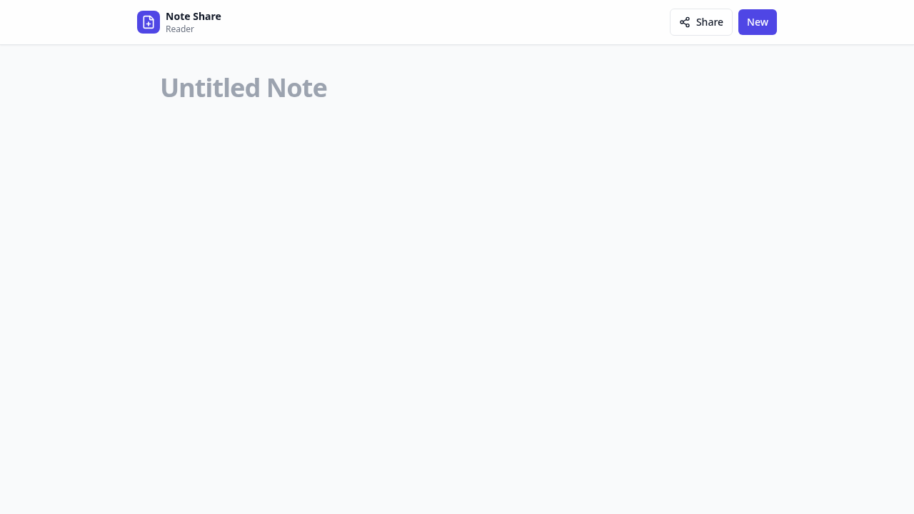
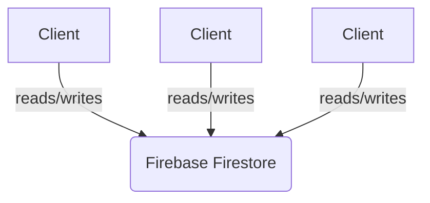

<!-- START doctoc generated TOC please keep comment here to allow auto update -->
<!-- DON'T EDIT THIS SECTION, INSTEAD RE-RUN doctoc TO UPDATE -->
## Table of Contents

- [Notes](#notes)
  - [🌟 Overview](#-overview)
  - [✨ Key Features](#-key-features)
  - [📸 Screenshots](#-screenshots)
  - [🚀 Quick Start](#-quick-start)
    - [Prerequisites](#prerequisites)
    - [Installation](#installation)
    - [Running the App](#running-the-app)
  - [🛠️ Dependencies](#-dependencies)
  - [Архитектура](#%D0%90%D1%80%D1%85%D0%B8%D1%82%D0%B5%D0%BA%D1%82%D1%83%D1%80%D0%B0)
  - [🛣️ Roadmap](#-roadmap)
  - [🤝 Contributing](#-contributing)
  - [📄 License](#-license)
  - [💖 Acknowledgements](#-acknowledgements)

<!-- END doctoc generated TOC please keep comment here to allow auto update -->

<div align="center">
  
  <h1>Notes</h1>
  <p>A real-time, collaborative note-taking application.</p>
  <div align="center">
    <a href="https://github.com/javilopezg/notes/actions/workflows/documentation.yml"></a>
    <a href="https://github.com/javilopezg/notes/blob/main/LICENSE"></a>
    <a href="https://github.com/javilopezg/notes/tags"></a>
    <a href="https://securityscorecards.dev/viewer/?uri=github.com/JaviLopezG/notes"></a>
  </div>
</div>

---

## 🌟 Overview

**Notes** is a simple yet powerful collaborative note-taking application that allows multiple users to edit a document in real-time. No registration is required—just share the link, and anyone can join in.

## ✨ Key Features

*   **Real-Time Collaboration:** Powered by Firebase Firestore, changes are synced instantly across all connected clients.
*   **Anonymous Access:** No login or identification is needed. Anyone with the URL can view and edit the note.
*   **Simplicity:** A clean, minimalist interface that focuses on the note-taking experience.
*   **Easy to Deploy:** The application can be deployed to any static hosting service.

## 📸 Screenshots

<div align="center">
  
</div>

## 🚀 Quick Start

To get a local copy up and running, follow these simple steps.

### Prerequisites

*   Node.js (v18 or higher)
*   npm

### Installation

```bash
npm install
```

### Running the App

```bash
npm run dev
```

## 🛠️ Dependencies

The project relies on the following dependencies:

*   **React:** A JavaScript library for building user interfaces.
*   **Vite:** A fast build tool for modern web projects.
*   **Firebase:** A platform for building web and mobile applications.
*   **Tailwind CSS:** A utility-first CSS framework for rapid UI development.
*   **Lucide React:** A library of beautiful and consistent icons.

## Архитектура

The application follows a simple client-server architecture, with the client-side built as a single-page application (SPA) using React and Vite. Firebase Firestore serves as the backend, providing real-time data synchronization.



## 🛣️ Roadmap

This is currently a "weekend project." Future development depends on community interest and feedback. Potential future features include:

*   Customizable Firebase configurations.
*   Improved stability and error handling.
*   Multiple notes/documents.

## 🤝 Contributing

Suggestions, feedback, and contributions are welcome! Please feel free to open an issue or submit a pull request.

## 📄 License

This project is licensed under the BSD 3-Clause License. See the [LICENSE](LICENSE) file for details.

## 💖 Acknowledgements

*   [React](https://react.dev/)
*   [Vite](https://vitejs.dev/)
*   [Firebase](https://firebase.google.com/)
*   [Tailwind CSS](https://tailwindcss.com/)
*   [Lucide](https://lucide.dev/)

---

<div align="center">
  <a href="https://javilopezg.com" target="_blank">
    
  </a>
  <a href="https://mastodon.social/@javilopezg" target="_blank">
    
  </a>
</div>